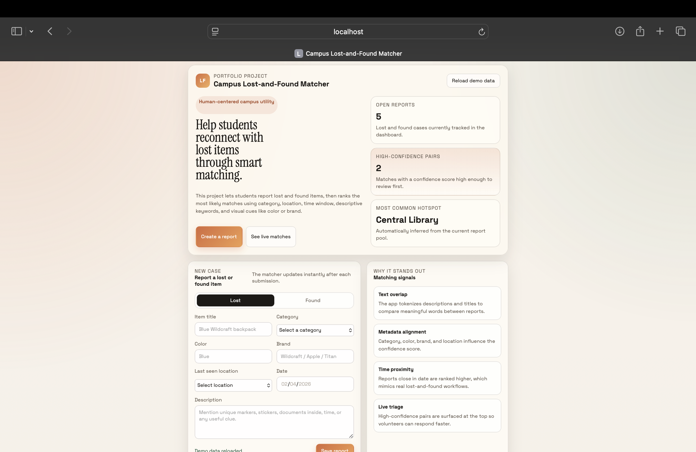
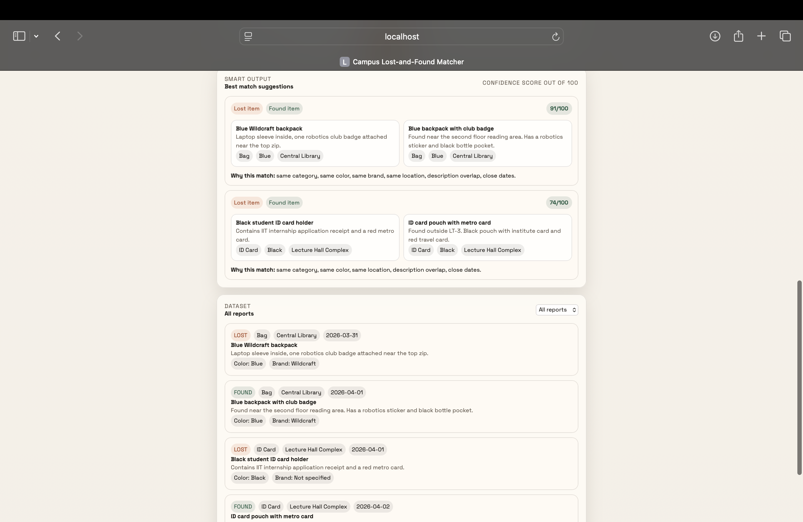

# Campus Lost-and-Found Matcher

A smart campus utility that helps students report lost and found items and automatically surfaces the most likely matches using a confidence-based scoring system.

## Problem Statement

On most campuses, lost-and-found processes are manual, slow, and hard to track. Students often post in random groups or ask around without a structured way to match lost items with found ones.

This project solves that by providing a simple dashboard where users can:

- submit lost item reports
- submit found item reports
- view all reports in one place
- see the most probable matches ranked by confidence

## Project Highlights

- clean and responsive dashboard UI
- rule-based matching algorithm
- confidence scoring out of 100
- instant UI updates after report submission
- report filtering and hotspot insights
- browser persistence using `localStorage`

## Screenshots

### Dashboard Overview



### Match Suggestions and Report Feed



## How It Works

When a user submits a report, the system compares lost and found items and calculates a confidence score based on multiple signals.

### Matching Parameters

- `Category match`
  Matches items like bag, ID card, electronics, accessory, and more.

- `Color match`
  Improves the score when both reports mention the same color.

- `Brand match`
  Gives stronger confidence when the same brand appears in both reports.

- `Location match`
  Prioritizes reports from the same place, such as Central Library or Lecture Hall Complex.

- `Date proximity`
  Reports submitted on the same or nearby dates are ranked higher.

- `Keyword overlap`
  The system compares important words from the title and description to identify similarity.

Only matches above a meaningful threshold are shown in the suggestion panel.

## Real-Time Style Example

If a student reports a lost `blue Wildcraft backpack` in the `Central Library`, and another student reports finding a `blue backpack with a robotics badge` in the same location around the same date, the system compares:

- category
- color
- brand
- location
- date
- words like `backpack`, `blue`, `badge`, and `robotics`

Because multiple signals match, the system gives that pair a high score and shows it in the top suggestions.

## Features

- submit lost and found reports
- view all reports in a structured dashboard
- smart match suggestions with confidence score
- analytics cards for report count and hotspot location
- demo dataset for quick presentation
- filter reports by `lost` or `found`
- responsive layout for desktop and mobile

## Tech Stack

- `HTML`
- `CSS`
- `Vanilla JavaScript`
- `localStorage`

## Project Structure

```text
campus-lost-and-found-matcher/
├── docs/
│   ├── dashboard-overview.png
│   └── matching-results.png
├── app.js
├── index.html
├── styles.css
└── README.md
```

## Run Locally

From the project folder:

```bash
python3 -m http.server 8080
```

Then open:

```text
http://localhost:8080/
```

If you run the server from the parent folder instead, open:

```text
http://localhost:8080/campus-lost-and-found-matcher/
```

## Future Scope

- add user authentication
- add image upload for items
- connect to a backend database
- enable multi-user live synchronization with WebSockets
- use NLP or embeddings for advanced text similarity
- add admin verification and contact flow

## Author

Muskan Tiwari
